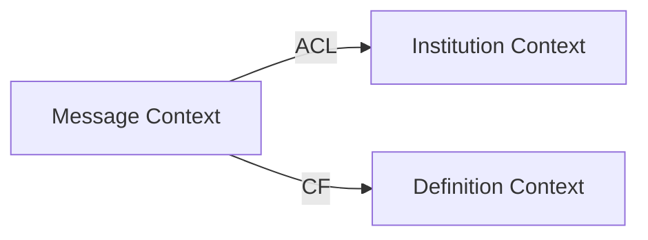

# Set Standards Skill

Establishes prescriptive architecture and coding standards that all future SDD workflow stages must follow.

## Purpose

This skill declares **how things should be built** (prescriptive), distinct from the `knowledge` skill which reverse-engineers **how things currently are** (descriptive). Never merge their outputs.

## Seed Material

Two company standards documents are ground truth and MUST be ingested verbatim:

1. **SWA_101 — Inter-Service Communication Standards**
   - REST URL structure, versioning, envelope shape
   - Header contracts, idempotency rules
   - Error code ranges, HTTP status mapping
   - Async messaging / channel naming
   - Security: OAuth2 + JWS requirements
   - OpenTelemetry tracing
   - Protocol selection: REST/gRPC/SOAP

2. **SAW_102 — Architecture Documentation Standards**
   - Required documentation artifacts per product type
   - `/documents/` repo folder structure
   - C4 model levels + draw.io tooling
   - ADR format (MADR/Persian, immutability rules)
   - DDD Context Map (Mermaid + relationship patterns)
   - OpenAPI 3.x and AsyncAPI 3.0.0 mandatory structures
   - Data Catalog integration
   - Tool-selection matrix for docs

Both are stored in `.claude/skills/set-standards/standards/` for direct consumption by downstream skills.

## Workflow

### Phase 0 — Seed Material Check

1. Check for `standards/SWA_101-comm-standards.md` in this skill's folder
2. Check for `standards/SAW_102-arch-doc-standards.md` in this skill's folder
3. If missing, prompt user to provide the documents:
   ```
   "I need the SWA_101 and SAW_102 standards documents to proceed.
   Please provide the file paths or paste the content."
   ```

### Phase 1 — Questionnaire

Run as a **questionnaire-based workflow** (not interactive back-and-forth). Present all questions upfront, grouped by domain.

#### Domain 1: API & Messaging (from SWA_101)

For domains fully covered by SWA_101, **confirm scope and exceptions** rather than re-derive:

```
## API & Messaging Standards

Based on SWA_101, the following rules apply:

- URL structure: /api/v{N}/{resource}
- Envelope format: { "data": {}, "meta": {}, "errors": [] }
- Idempotency: X-Idempotency-Key header required for POST/PUT
- Error codes: MSG-XXX format, Persian responses
- HTTP status: 2xx/4xx/5xx per SWA_101 mapping
- Async channels: {domain}.{event}.{version}
- Protocol: REST (default), gRPC for internal high-throughput

**Questions:**

1. This project is a new product — confirm all SWA_101 REST rules apply from day one?
   [ ] Yes, all rules apply
   [ ] No, exceptions needed (specify below)
   Exceptions: _______________

2. Are there any protocol overrides needed? (default: REST)
   [ ] REST only
   [ ] gRPC for specific internal services: _______________
   [ ] SOAP for legacy integration: _______________

3. Is async messaging required for this product?
   [ ] Yes, using channel pattern: {domain}.{event}.{version}
   [ ] No async messaging in phase 1
   [ ] Custom channel naming: _______________
```

#### Domain 2: Security & Auth (from SWA_101)

```
## Security & Authentication Standards

Based on SWA_101 §7:

- OAuth2 resource server pattern
- JWS signature verification via JWKS
- AMS permission declarations
- Token forwarding for inter-service calls
- OpenTelemetry tracing with redaction rules

**Questions:**

1. OAuth2 provider:
   Current config: https://sso.tps.ir/.well-known/openid-configuration/jwks
   [ ] Use existing SSO configuration
   [ ] Different provider: _______________

2. Permission model:
   [ ] Use AMS permission declarations from SWA_101
   [ ] Custom permission structure: _______________

3. Tracing & logging redaction:
   [ ] Apply SWA_101 redaction rules (token, PII, credentials)
   [ ] Custom redaction rules: _______________
```

#### Domain 3: Documentation & Architecture (from SAW_102)

```
## Documentation & Architecture Standards

Based on SAW_102, the following artifacts are required by product type.

**Questions:**

1. Product type (determines required artifacts):
   [ ] New product — all Phase-1 artifacts required
   [ ] Enhancement to existing product — subset applies
   [ ] Internal service — minimal set applies
   Specify: _______________

2. ADR format preference:
   [ ] MADR format (English)
   [ ] Persian ADR format
   [ ] Hybrid: English structure + Persian commentary

3. C4 model level required:
   [ ] Level 1: System Context
   [ ] Level 2: Container
   [ ] Level 3: Component
   [ ] Level 4: Code (if needed)

4. Diagram tooling:
   [ ] draw.io (per SAW_102)
   [ ] Mermaid for simple diagrams
   [ ] Both: draw.io for C4, Mermaid for spec docs

5. OpenAPI version:
   Current: SpringDoc OpenAPI 2.6.0
   [ ] Continue with SpringDoc auto-generation
   [ ] Manual OpenAPI 3.x spec required

6. AsyncAPI requirement:
   [ ] Required if async messaging (SAW_102 §5)
   [ ] Not applicable to this product
```

#### Domain 4: Coding Conventions (Interview)

This domain is NOT covered by SWA_101/SAW_102 — interview the user:

```
## Coding Conventions

SWA_101/SAW_102 don't cover language-specific conventions. Help me establish:

**Questions:**

1. Java/Spring Boot conventions:
   [ ] Follow existing project patterns (read codebase first)
   [ ] Apply company Java standards document: _______________
   [ ] Use Spring Boot best practices + project-specific rules below

   Additional rules: _______________

2. Layering pattern:
   Current: Controller → Service → Repository
   [ ] Continue with current layering
   [ ] Add separate validation layer
   [ ] Apply different pattern: _______________

3. DTO vs Entity usage:
   Current: Separate DTO and Entity classes
   [ ] Keep separation (entities internal, DTOs at API boundary)
   [ ] Use mapstruct for conversion
   [ ] Different approach: _______________

4. Error handling:
   Current: Global exception handler with error codes
   [ ] Continue current pattern
   [ ] Enhance with specific exception types per domain
   [ ] Different approach: _______________

5. Testing conventions:
   Current: Testcontainers for integration tests
   [ ] Continue Testcontainers + unit test split
   [ ] Add contract testing
   [ ] Different approach: _______________

6. Naming conventions:
   [ ] Follow Java/Spring Boot defaults
   [ ] Company-specific naming rules: _______________

7. Code quality gates:
   [ ] Maven build must pass
   [ ] Minimum test coverage: _____ %
   [ ] Static analysis tool: _______________
```

### Phase 2 — Conflict Detection

Detect and flag conflicts between SWA_101/SAW_102 and the project's tech stack:

```
## Conflict Detection

Checking for conflicts between company standards and project setup:

1. SWA_101 assumes OAuth2 + JWS — your project uses: OAuth2 resource server ✓
2. SAW_102 requires OpenAPI 3.x — you have SpringDoc 2.6.0 ✓
3. SWA_101 §3 requires X-Idempotency-Key header — not seen in current API
   → Open question: Should idempotency keys be added to POST /api/v1/messages?

[ ] Conflict noted, will address in Technical Questions
[ ] Exception granted for this project: _______________
```

### Phase 3 — Write Standards Files

Create `/standards/` directory at project root and write domain files:

#### File: `/standards/api-and-messaging.md`

```markdown
# API & Messaging Standards

Source: SWA_101 — Inter-Service Communication Standards

## 1. URL Structure

- Pattern: `/api/v{N}/{resource}`
- Version in path, not header
- Resource names: plural, lowercase, kebab-case
- Example: `/api/v1/messages`, `/api/v1/message-definitions`

## 2. Request/Response Envelope

### Success Response
```json
{
  "data": { /* resource data */ },
  "meta": {
    "requestId": "uuid",
    "timestamp": "ISO-8601"
  }
}
```

### Error Response
```json
{
  "data": null,
  "meta": {
    "requestId": "uuid",
    "timestamp": "ISO-8601"
  },
  "errors": [
    {
      "code": "MSG-001",
      "message": "Persian error message",
      "field": "fieldName",
      "details": {}
    }
  ]
}
```

## 3. Headers

Required:
- `X-Request-ID`: UUID for tracing
- `X-Idempotency-Key`: UUID for POST/PUT (idempotent operations)
- `Authorization`: Bearer token

Optional:
- `Accept-Language`: For response language
- `X-Forwarded-For`: Client IP chain

## 4. Idempotency

- POST/PUT operations MUST include `X-Idempotency-Key`
- Server returns same response for same key within TTL
- TTL: 24 hours (configurable)
- Duplicate detection: store key + response in cache

## 5. Error Codes

- Format: `{DOMAIN}-{NUMBER}` (e.g., `MSG-001`)
- Domain prefixes: `MSG` (messaging), `INST` (institution), `DEF` (definition)
- HTTP status mapping per SWA_101 §4
- All error messages in Persian (per project requirement)

## 6. HTTP Status Codes

| Code | Usage |
|------|-------|
| 200 | Success (GET, PUT) |
| 201 | Created (POST) |
| 204 | No content (DELETE) |
| 400 | Validation error |
| 401 | Unauthorized |
| 403 | Forbidden |
| 404 | Not found |
| 409 | Conflict (duplicate, state mismatch) |
| 422 | Business rule violation |
| 500 | Internal error |

## 7. Async Messaging Channels

Pattern: `{domain}.{event}.{version}`

Examples:
- `message.created.v1`
- `message.validated.v1`
- `institution.updated.v1`

## 8. Protocol Selection

Default: REST

gRPC: Internal high-throughput services (requires architectural decision)

SOAP: Legacy integration only (requires exception approval)

## Exceptions for This Project

- [List any confirmed exceptions from questionnaire]

## Confidence Score

[ ] /10 — [reason for any shortfall]
```

#### File: `/standards/security-and-auth.md`

```markdown
# Security & Authentication Standards

Source: SWA_101 §7 — Security Requirements

## 1. OAuth2 Resource Server

- Pattern: Resource server validates tokens via JWKS
- JWKS endpoint: `https://sso.tps.ir/.well-known/openid-configuration/jwks`
- Token type: JWT (RS256 signed)

## 2. JWS Signature Verification

- Fetch public keys from JWKS endpoint
- Cache keys (refresh on key rotation)
- Validate: signature, expiry, issuer, audience

## 3. AMS Permission Declarations

- Permission format: `resource:action` (e.g., `messages:create`)
- Declare in service layer
- Enforce via `@PreAuthorize` annotations

## 4. Token Forwarding

- For inter-service calls, forward user's token
- Use `Authorization: Bearer {token}` header
- Never expose token in logs

## 5. OpenTelemetry Tracing

- Trace all HTTP requests
- Propagate trace context: `traceparent`, `tracestate` headers
- Redaction rules (never log):
  - Authorization headers
  - Passwords, tokens, secrets
  - PII fields (national ID, account numbers)

## 6. HTTPS Enforcement

- All external traffic over HTTPS
- TLS 1.2+ required
- Certificate validation enabled

## Exceptions for This Project

- [List any confirmed exceptions from questionnaire]

## Confidence Score

[ ] /10 — [reason for any shortfall]
```

#### File: `/standards/documentation-and-architecture.md`

```markdown
# Documentation & Architecture Standards

Source: SAW_102 — Architecture Documentation Standards

## 1. Required Artifacts by Product Type

### New Product (Phase 1)
- [ ] System Context diagram (C4 Level 1)
- [ ] Container diagram (C4 Level 2)
- [ ] Component diagram (C4 Level 3) — per epic
- [ ] OpenAPI 3.x spec
- [ ] Data model / ERD
- [ ] ADRs for major decisions

### Enhancement to Existing Product
- [ ] Component diagram (affected areas)
- [ ] Updated OpenAPI spec
- [ ] ADR for architectural changes

### Internal Service
- [ ] Container diagram
- [ ] OpenAPI spec

## 2. Folder Structure

```
/documents/
├── architecture/
│   ├── c4/
│   │   ├── level-1-context.drawio
│   │   ├── level-2-container.drawio
│   │   └── level-3-component/
│   │       └── {epic-slug}.drawio
│   └── adr/
│       └── NNN-title.md
├── api/
│   ├── openapi.yaml
│   └── asyncapi.yaml (if async messaging)
├── data/
│   └── erd.drawio
└── README.md
```

## 3. ADR Format

Use MADR format with Persian commentary (if required):

```markdown
# ADR-NNN: Title

## Status
[Proposed | Accepted | Deprecated | Superseded]

## Context
[Describe the situation and problem]

## Decision
[Describe the decision]

## Consequences
[Describe impact]

## Persian Notes (optional)
[توضیحات به فارسی]
```

## 4. C4 Model

- Level 1: System Context (external actors, systems)
- Level 2: Container (applications, databases, services)
- Level 3: Component (major components per container)
- Level 4: Code (classes, functions) — rarely needed

Tool: draw.io with C4 model stencil

## 5. DDD Context Map

Use Mermaid for Context Maps:



Relationship patterns:
- ACL: Anti-Corruption Layer
- CF: Conformist
- OHS: Open Host Service
- PL: Published Language

## 6. OpenAPI 3.x Requirements

- Auto-generated via SpringDoc (current: 2.6.0)
- Include: paths, schemas, security schemes
- Host at: `/api-docs`, `/swagger-ui.html`
- Version in path: `/api/v1/...`

## 7. AsyncAPI 3.0.0 Requirements

Required if async messaging:
- Channels matching `{domain}.{event}.{version}`
- Message schemas
- Security requirements
- Bindings (Kafka, AMQP, etc.)

## 8. Data Catalog Integration

- Register all entities in data catalog
- Include: field descriptions, PII flags, sensitivity levels
- Link to OpenAPI schemas

## Exceptions for This Project

- [List any confirmed exceptions from questionnaire]

## Confidence Score

[ ] /10 — [reason for any shortfall]
```

#### File: `/standards/coding-conventions.md`

```markdown
# Coding Conventions

Source: Interview + Existing Project Patterns

## 1. Java/Spring Boot Conventions

- Java version: 21
- Spring Boot version: 3.3.2
- Follow Spring Boot best practices
- Use constructor injection (Lombok `@RequiredArgsConstructor`)

## 2. Layering Pattern

```
Controller → Service → Repository
           ↓
      Validation Service (external)
```

- Controllers: HTTP handling only, delegate to services
- Services: Business logic, orchestration
- Repositories: Data access only
- Validation services: Cross-cutting validation rules

## 3. DTO vs Entity

- Entities: Database mapping, internal to service layer
- DTOs: API boundary, exposed to controllers
- Mapping: Manual mapping (no mapstruct currently)

## 4. Error Handling

- Global `@ControllerAdvice` exception handler
- Custom exceptions per domain (`MessageException`, `InstitutionException`)
- Error codes: `MSG-XXX` format
- All error messages in Persian

## 5. Testing Conventions

- Unit tests: JUnit 5 + Mockito
- Integration tests: Testcontainers (PostgreSQL)
- Naming: `{Class}Test` for unit, `{Class}IntegrationTest` for integration
- Coverage: Run via `mvn test`

## 6. Naming Conventions

- Classes: PascalCase (`MessageService`)
- Methods: camelCase (`createMessage`)
- Constants: UPPER_SNAKE (`MAX_RETRY_COUNT`)
- Packages: lowercase (`com.bank.messaging`)

## 7. Code Quality Gates

- Build: `mvn clean package` must pass
- Tests: All tests must pass
- Code style: Follow project IntelliJ/Eclipse formatter

## 8. Logging

- Use SLF4J with Lombok `@Slf4j`
- Log levels: ERROR, WARN, INFO, DEBUG
- Never log: tokens, passwords, PII
- Use MDC for request tracing

## 9. Database Conventions

- Flyway migrations in `src/main/resources/db/migration/`
- Naming: `V{N}__description.sql`
- Entity IDs: Long (auto-generated)
- Audit fields: `createdAt`, `updatedAt` (managed by JPA)

## 10. Cache Conventions

- Caffeine cache: max 1000 entries, TTL 300s
- Cache at service layer
- Invalidate on updates

## Exceptions for This Project

- [List any confirmed exceptions from questionnaire]

## Confidence Score

[ ] /10 — [reason for any shortfall]
```

### Phase 4 — Consumption Contract

Write to end of each standards file:

```markdown
---

## Consumption Contract

Downstream skills MUST read this file and validate against its rules:

### write-spec
- MUST validate all API paths against `/standards/api-and-messaging.md` §1 before finalizing spec
- MUST use error code format from §5
- MUST apply envelope format from §2
- MUST check security requirements from `/standards/security-and-auth.md`

### plan-tasks
- MUST order tasks to implement standards-compliant components first
- MUST flag any task that violates standards

### implement-epic
- MUST implement according to coding conventions in `/standards/coding-conventions.md`
- MUST validate API changes against `/standards/api-and-messaging.md`
- MUST write tests per `/standards/coding-conventions.md` §5

### Architecture Advisors
- MUST reference `/standards/documentation-and-architecture.md` for required artifacts
- MUST enforce C4 model levels and tooling
- MUST check OpenAPI/AsyncAPI requirements
```

## File Locations

```
{project root}/
├── standards/
│   ├── api-and-messaging.md
│   ├── security-and-auth.md
│   ├── documentation-and-architecture.md
│   └── coding-conventions.md
└── .claude/skills/set-standards/
    ├── SKILL.md
    └── standards/
        ├── SWA_101-comm-standards.md
        └── SAW_102-arch-doc-standards.md
```

## Hard Rules

1. Never paraphrase SWA_101/SAW_102 — store verbatim in skill's `standards/` folder
2. Never merge prescriptive (this skill) with descriptive (`knowledge`) output
3. Never skip the questionnaire — even if SWA_101/SAW_102 cover most rules
4. Never resolve conflicts silently — flag as open questions
5. Always compute and report confidence score per domain
6. Always write the consumption contract so downstream skills have hard dependencies
7. Never mark confidence 10/10 if questionnaire has unanswered questions or exceptions exist

## Exit Criteria

Skill is done when:
1. All four domain files written to `/standards/`
2. Each has a confidence score
3. Each has the consumption contract
4. Any conflicts between SWA_101/SAW_102 and project are flagged
5. User has confirmed exceptions (if any)

"Confidence ≥ 8/10 on all domains" is the threshold for downstream skills to rely on these standards without re-validation — not a gate for this skill to produce output.
