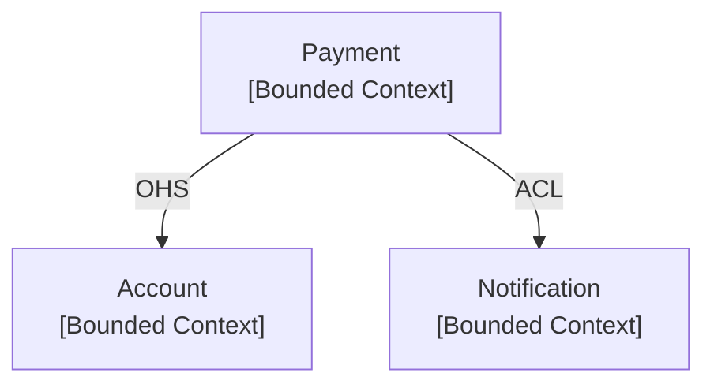

# Architecture Documentation Standards (SAW_102 v1.0)
# Source: Dotin Software Architecture Standard — enforced for ALL documentation generation

> These standards MUST be followed whenever generating, scaffolding, or modifying
> any architecture documentation artifact: C4 diagrams, ADRs, Context Maps,
> OpenAPI specs, AsyncAPI specs, or Data Catalog entries.

---

## 1. Required Documentation Artifacts

| Artifact | New Products | Existing Products |
|---|---|---|
| C4 Model (L1 + L2 mandatory, L3 recommended) | ✅ Required from day 1 | Phase 1 |
| ADRs (all key decisions) | ✅ Required from day 1 | Phase 2 |
| DDD Context Map | ✅ Required from day 1 | Phase 3 |
| OpenAPI spec | ✅ Required from day 1 | Phase 3 |
| AsyncAPI spec (if async comms exist) | ✅ Required from day 1 | Phase 3 |
| Data Catalog (data-driven products only) | ✅ Required from day 1 | Phase 1 |

---

## 2. Repository Folder Structure

ALL documentation MUST live inside the project repository (Bitbucket) under `/documents/`:

```
/documents/
├── c4/
│   └── README.md          # Links to draw.io diagrams on Confluence
├── adr/
│   ├── README.md          # Auto or manually maintained ADR index
│   └── ADR-NNNN.short-title-of-decision.md
├── cmap/
│   └── context_map.md     # Mermaid diagram + explanation
├── openapi/
│   ├── README.md          # Optional extra notes
│   └── openapi.yaml       # OpenAPI 3.x spec
├── asyncapi/
│   ├── README.md          # Optional extra notes
│   └── asyncapi.yaml      # AsyncAPI 3.0.0 spec
└── datamodels/
    └── README.md          # Links to ERD diagrams on Confluence + data dictionary
```

Rules:
- Documentation changes MUST be committed in the **same commit or PR** as the related code change.
- Commit messages must clearly describe the documentation change.
- Access permissions to `/documents/` MUST be identical to source code access.

---

## 3. C4 Model

### Levels
| Level | Name | Required? | Tool |
|---|---|---|---|
| 1 | System Context | ✅ Mandatory | draw.io on Confluence |
| 2 | Containers | ✅ Mandatory | draw.io on Confluence |
| 3 | Components | ✅ Mandatory | draw.io on Confluence |
| 4 | Code | ⚪ Optional (only for critical/complex logic) | draw.io on Confluence |

### Rules
- Diagrams are drawn in **draw.io** (via the Confluence plugin) — NOT in Mermaid.
- The `c4/README.md` file MUST contain links to the Confluence pages hosting these diagrams.
- For Container-level diagrams that include data storage components (databases, data warehouses), the description of that container MUST include a link to the relevant Data Catalog entry.

### `c4/README.md` Template
```markdown
# C4 Architecture Diagrams

## System Context (Level 1)
[Link to Confluence diagram](https://confluence.dotin.ir/...)

## Containers (Level 2)
[Link to Confluence diagram](https://confluence.dotin.ir/...)

## Components (Level 3)
### [Service/Container Name]
[Link to Confluence diagram](https://confluence.dotin.ir/...)

## Code (Level 4) — Optional
### [Component Name]
[Link to Confluence diagram](https://confluence.dotin.ir/...)
```

---

## 4. Architecture Decision Records (ADRs)

### When to Write an ADR
Write an ADR for every technical decision that significantly affects:
- System structure or architecture
- Non-functional requirements (performance, security, scalability)
- Key design patterns
- Core technology choices

### File Naming
```
ADR-[NNNN].[short-title-in-kebab-case].md
```
- Number starts at `0001` and increments sequentially.
- Separator between number and title is `.`
- Title is in `kebab-case`.

**Examples:**
```
ADR-0001.use-postgresql-database.md
ADR-0002.use-cqrs-pattern.md
ADW-0003.choose-kafka-as-message-broker.md
```

### MADR Template (Persian — strictly follow this format)

```markdown
# ADR-[شماره]. [عنوان کوتاه تصمیم]

- **وضعیت:** [پیشنهادی | پذیرفته شده | رد شده | منسوخ شده | جایگزین شده توسط ADR-XXX]
- **تاریخ:** [سال-ماه-روز]
- **نویسندگان:** [نویسنده ۱، نویسنده ۲]
- **اسناد تحت تأثیر:** [شماره ADRهایی که ممکن است نیاز به تغییر داشته باشند] *(اختیاری)*

## زمینه و شرح مسئله

[توضیح شرایط، مسئله یا نیازمندی که منجر به این تصمیم شد.]

## محرکهای تصمیمگیری

- عامل ۱:
- عامل ۲:
- عامل ۳:

## گزینههای بررسیشده

- گزینه ۱:
- گزینه ۲:
- گزینه ۳:

## نتیجه تصمیم

گزینه انتخابی: "[گزینه انتخاب شده]"، زیرا [توضیح دلایل اصلی انتخاب این گزینه نسبت به سایر گزینهها]

### پیامدهای مثبت

- [اثرات مثبت مورد انتظار یا مشاهده شده]

### پیامدهای منفی

- [اثرات منفی، ریسکها یا بدهیهای فنی مورد انتظار یا مشاهده شده]

## پیوندها *(اختیاری)*

- [لینک به مستندات مرتبط، ایشوهای Jira، صفحات Confluence و ...]
```

### ADR Statuses
| Status (Persian) | When to use |
|---|---|
| پیشنهادی | Draft — under team review, not yet final |
| پذیرفته شده | Agreed by team, being implemented |
| رد شده | Rejected — better alternative exists |
| منسوخ شده | No longer valid, but no direct replacement |
| جایگزین شده توسط ADR-XXXX | Superseded by a newer ADR |

### Immutability Rule — CRITICAL
- **NEVER delete or edit an accepted ADR's content.**
- ADRs are a permanent historical record.
- To "change" a decision after acceptance:
  1. Create a **new ADR** with the updated decision.
  2. Reference the old ADR in the new one's context section.
  3. Change the old ADR's status to `جایگزین شده توسط ADR-[new number]` and add a link.
- Before acceptance (status = پیشنهادی): direct editing is allowed.

### Mermaid in ADRs
Diagrams inside ADR files MUST use Mermaid (not draw.io):
```markdown
```mermaid
graph LR
    A[Service A] --> B[Kafka Topic]
    B --> C[Service B]
` `` 
```

---

## 5. DDD Context Map

### File Location
`/documents/cmap/context_map.md`

### Tool
**Mermaid** — embedded directly in the Markdown file (NOT draw.io).

### Required DDD Relationship Patterns
Every relationship between Bounded Contexts MUST be labeled with one of these standard DDD patterns:

| Pattern | Abbreviation |
|---|---|
| Open Host Service | OHS |
| Partnership | Partnership |
| Shared Kernel | SK |
| Customer-Supplier | C/S |
| Conformist | CF |
| Anticorruption Layer | ACL |
| Separate Ways | SW |

### Example Structure
```markdown
# Context Map

## نمودار



## توضیحات روابط

### Payment → Account (OHS)
...

### Payment → Notification (ACL)
...
```

---

## 6. OpenAPI Specification

### File
`/documents/openapi/openapi.yaml`

### Version
Always use **OpenAPI 3.x** (`3.0.3` or `3.1.0`).

### Mandatory Structure
```yaml
openapi: 3.0.3

info:
  title: "Descriptive and unique API title"
  description: |
    Full description of the API, its purpose, target consumers, and useful links.
  version: "1.2.0"   # Semantic versioning — MUST match actual deployed version

servers:
  - url: https://api.dotin.ir/service-name
    description: Production
  - url: https://api-dev.dotin.ir/service-name
    description: Development

security:
  - bearerAuth: []

paths:
  /v1/resources:
    get:
      summary: "..."
      description: "..."
      parameters:
        - $ref: '#/components/parameters/AcceptLanguage'
      responses:
        '200':
          description: "Success"
          content:
            application/json:
              schema:
                $ref: '#/components/schemas/ResourceListResponse'
        '400':
          $ref: '#/components/responses/BadRequest'
        '401':
          $ref: '#/components/responses/Unauthorized'
        '500':
          $ref: '#/components/responses/InternalServerError'

components:
  securitySchemes:
    bearerAuth:
      type: http
      scheme: bearer
      bearerFormat: JWT

  parameters:
    AcceptLanguage:
      name: Accept-Language
      in: header
      required: false
      schema:
        type: string
        example: "fa"

  schemas:
    # Define ALL request and response body schemas here
    ResourceListResponse:
      type: object
      properties:
        resultData:
          type: array
          items:
            $ref: '#/components/schemas/Resource'
        message:
          type: string
        errorList:
          type: array
          items:
            $ref: '#/components/schemas/ErrorItem'

    ErrorItem:
      type: object
      required: [issuer, code, description]
      properties:
        issuer:
          type: string
          example: "PAY"
        code:
          type: integer
          example: 101
        description:
          type: string
        details:
          type: array
          items:
            type: object
            properties:
              path:
                type: string
                example: "/v1/customers/10025/#phoneNumber"

  responses:
    BadRequest:
      description: "Bad Request"
      content:
        application/json:
          schema:
            $ref: '#/components/schemas/ErrorResponse'
    Unauthorized:
      description: "Unauthorized"
    InternalServerError:
      description: "Internal Server Error"
```

### Rules
- Every request body and response body MUST reference a `$ref` to `components/schemas` — no inline schemas.
- EVERY path, parameter, field, and schema MUST have a `description`.
- ALL possible responses (success AND error) MUST be defined for every path.
- Authentication requirements MUST be defined in `securitySchemes` and applied globally or per-operation.
- The `info.version` value MUST match the actual API version (also used in URL path `/v1/`, `/v2/`).
- Use `components` aggressively to avoid repetition.

---

## 7. AsyncAPI Specification

### File
`/documents/asyncapi/asyncapi.yaml`

### Version
Always use **AsyncAPI 3.0.0**.

### Mandatory Structure
```yaml
asyncapi: 3.0.0

info:
  title: "Descriptive API title"
  description: |
    Full description — purpose, key events, overall architecture context.
  version: "1.0.0"  # Semantic versioning

servers:
  production-kafka:
    host: broker.kafka-cluster.dotin.ir:9092
    protocol: kafka
    description: Production Kafka cluster

channels:
  corridor.core.deposit.status-changed.topic.v1:
    description: "Published when deposit status changes"
    messages:
      DepositStatusChanged:
        $ref: '#/components/messages/DepositStatusChangedMessage'

operations:
  publishDepositStatusChanged:
    action: send
    channel:
      $ref: '#/channels/corridor.core.deposit.status-changed.topic.v1'
    messages:
      - $ref: '#/channels/corridor.core.deposit.status-changed.topic.v1/messages/DepositStatusChanged'

components:
  messages:
    DepositStatusChangedMessage:
      name: DepositStatusChanged
      title: "Deposit Status Changed"
      description: "Emitted when a deposit account status transitions"
      payload:
        $ref: '#/components/schemas/DepositStatusChangedPayload'

  schemas:
    DepositStatusChangedPayload:
      type: object
      required: [metadata, accountId, newStatus, changedAt]
      properties:
        metadata:
          type: object
          description: "Optional non-business metadata"
        accountId:
          type: string
        newStatus:
          type: string
          enum: [ACTIVE, FROZEN, CLOSED]
        changedAt:
          type: string
          format: date-time
          description: "UTC ISO 8601, no offset"

  securitySchemes:
    saslScram:
      type: scramSha256
      description: "SASL/SCRAM authentication for Kafka"
```

### Rules
- ALL message payloads MUST reference a `$ref` to `components/schemas`.
- EVERY channel, operation, message, and schema field MUST have a `description`.
- Error handling: define error messages either on separate channels (e.g., `user.signup.error`) or as a structured field in the main message payload.
- Schema versioning: when a payload schema changes, update the `info.version` and document backward-compatibility strategy.
- Channel names MUST follow the SWA_101 naming convention: `corridor.[system].[domain].{component}.[event|command[.request|.response]].[topic|queue].v[N]{.dlt}`
- Authentication for the broker MUST be defined in `securitySchemes`.

---

## 8. Data Catalog (Data-Driven Products)

Applies to: BI products and any product that creates, processes, or manages significant data assets.

### Responsibilities
- Teams owning data assets MUST register all key assets (databases, warehouses, tables, views, data streams, models) in the central Data Catalog using the standard template (`DOC-DATA-ASSET-TPL-V1.0`).
- Metadata MUST include: technical info, business definitions, ownership, data lineage.
- All teams MUST search the Data Catalog before designing new data models to avoid redundancy.

### Integration with Other Docs
- **C4 Container diagrams**: containers representing data storage MUST link to their Data Catalog entry in the description.
- **ADRs**: decisions affecting data assets MUST reference the relevant Data Catalog entries.

### When Data Catalog is NOT Yet Available (Transition Period)
Document data models using:
1. **ERD diagrams** in draw.io on Confluence.
2. **Data Dictionaries** stored under `/documents/datamodels/README.md`.
3. Link ERD diagrams from the relevant C4 Container descriptions.

---

## 9. Tool Selection Rules

| Content Type | Tool | Location |
|---|---|---|
| C4 diagrams (all levels) | **draw.io** (Confluence plugin) | Confluence, linked from `c4/README.md` |
| ERD diagrams | **draw.io** (Confluence plugin) | Confluence, linked from `datamodels/README.md` |
| Context Map diagrams | **Mermaid** | Embedded in `cmap/context_map.md` |
| Diagrams inside ADRs | **Mermaid** | Embedded in the ADR `.md` file |
| All prose/text docs | **Markdown** (`.md`) | Bitbucket repo under `/documents/` |
| OpenAPI & AsyncAPI specs | **YAML** (`.yaml`) | Bitbucket repo under `/documents/` |

**NEVER** use draw.io for Context Maps or ADR diagrams — those use Mermaid.
**NEVER** use Mermaid for C4 or ERD diagrams — those use draw.io on Confluence.

---

## 10. Review & Approval Checklist

When generating any documentation artifact, verify all applicable items below:

### General
- [ ] File is in the correct path under `/documents/` with the correct format (`.md` or `.yaml`).
- [ ] Documentation is up-to-date with the corresponding code/architecture changes in the same PR.
- [ ] Writing is clear, precise, and professional.
- [ ] All internal/external links (e.g., to Confluence) are valid.

### C4 Model (`c4/README.md`)
- [ ] Links to Level 1 (Context) and Level 2 (Containers) Confluence diagrams are provided.
- [ ] Links to Level 3 (Component) diagrams for key containers are provided.
- [ ] Linked diagrams are readable and follow C4 notation.

### ADRs (`adr/*.md`)
- [ ] ADR is written for a significant architectural decision.
- [ ] Follows the MADR format (Persian).
- [ ] Status is correctly set.
- [ ] Context and problem are clearly stated.
- [ ] Considered options are logically listed.
- [ ] Decision rationale is clear and convincing.
- [ ] Positive and negative consequences are realistically stated.
- [ ] If Mermaid diagrams are used, syntax is valid and renders correctly.

### Context Map (`cmap/context_map.md`)
- [ ] Mermaid diagram is implemented directly in the file.
- [ ] All major Bounded Contexts are identified.
- [ ] Relationships are labeled with standard DDD patterns.
- [ ] Diagram is readable and not overly complex.

### OpenAPI (`openapi/openapi.yaml`)
- [ ] Valid OpenAPI 3.x YAML (validated with Swagger Editor or equivalent).
- [ ] `info` section (title, version) is complete.
- [ ] `servers` are correctly defined for all environments.
- [ ] All paths and HTTP methods are defined.
- [ ] All parameters (path, query, header), request bodies, and responses use `$ref` to `components`.
- [ ] Data models (`schemas`) are clear and well-structured.
- [ ] Security requirements (`securitySchemes` + `security`) are correctly defined.
- [ ] All possible responses (success and error) are defined for every path.

### AsyncAPI (`asyncapi/asyncapi.yaml`)
- [ ] Valid AsyncAPI 3.0.0 YAML (validated with AsyncAPI Studio or equivalent).
- [ ] `info` section (title, version) is complete.
- [ ] `servers` are correctly defined.
- [ ] `channels` are correctly defined using SWA_101 naming convention.
- [ ] `operations` are correctly defined.
- [ ] Message structures (`messages`) are clearly defined and reference `components/schemas`.
- [ ] Security requirements are defined.

### Data Models / Data Catalog
- [ ] Key data assets are registered in the central Data Catalog (if available).
- [ ] ERD diagrams (draw.io on Confluence) and data dictionaries are provided when Data Catalog is unavailable.
- [ ] Links from relevant C4 Container diagrams to Data Catalog / ERD are in place.
- [ ] Business owner and technical owner are identified for data assets.

---

*Based on SAW_102 Architecture Documentation Standards v1.0 — Dotin Platform*
